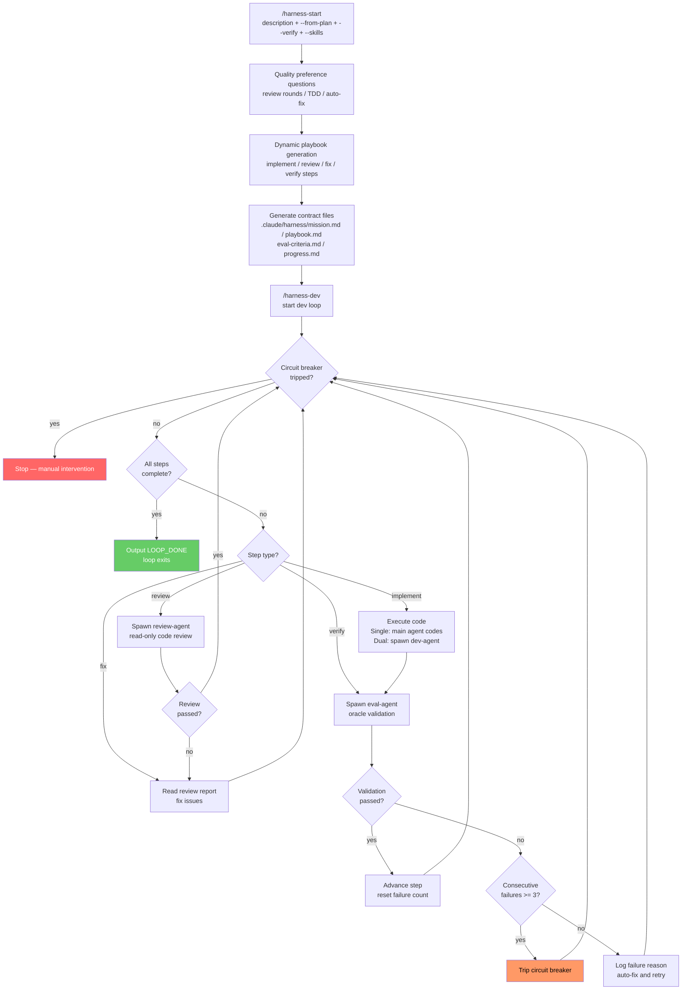

# OpenHarness for Claude Code

Autonomous AI agent execution framework adapted from [OpenHarness](https://github.com/thu-nmrc/OpenHarness) Harness Engineering principles for Claude Code.

English | [中文](README.md)

## What It Does

Turns Claude Code into a 24/7 autonomous development worker through **mechanical constraints, external audit, and 100% traceability**:

- **Machine-verifiable contracts** — objective "done" conditions, no subjective judgments
- **Oracle-isolated validation** — an independent agent validates your work; you cannot self-certify
- **Circuit breaker** — auto-stops after 3 consecutive failures
- **Three-layer memory** — state pointer (<2KB) + knowledge files + execution stream
- **Dynamic workflow** — automatically generates develop/review/fix cycles based on task needs
- **Switchable execution modes** — single (plan+code) or dual (plan → spawn coder agent)
- **Skill injection** — specify skills for the dev-agent to load on demand
- **`/loop` integration** — stop-hook drives step-by-step loop, one iteration per step

## Quick Start

```bash
# Install plugin
claude --plugin-dir /path/to/openharness-cc

# Initialize a new task
/harness-start "Build a REST API for user management" --verify "Ensure all tests pass"

# Start autonomous development loop
/loop /harness-dev

# Check current status
/harness-status
```

## Commands

| Command | Description |
|---|---|
| `/harness-start` | Initialize a new harness task with mission, playbook, eval criteria |
| `/harness-dev` | Start the autonomous development loop (single or dual mode) |
| `/harness-status` | Show current workspace status, progress, and circuit breaker state |
| `/harness-edit` | Modify an existing task (verify instruction, mission, playbook, etc.) |

## Usage

### Step 1: Initialize Task `/harness-start`

Tell Claude Code what you want done. The plugin auto-generates contract files.

```bash
# Describe the task directly
/harness-start "Add user registration and login" --verify "Ensure all tests pass"

# Initialize from a plan file (e.g., superpowers output)
/harness-start --from-plan docs/superpowers/specs/my-feature-design.md --mode dual

# Specify skills for the dev-agent
/harness-start "Add React components" --skills "tdd,react-patterns" --verify "All tests pass"
```

**Parameters:**

| Parameter | Required | Description | Example |
|---|---|---|---|
| `"task description"` | No* | One-sentence description of what you want, composable with `--from-plan` | `"Build REST API"` |
| `--from-plan PATH` | No* | Initialize from a plan/design file | `--from-plan plan.md` |
| `--mode single\|dual` | No | Execution mode, default `single` | `--mode dual` |
| `--verify "instruction"` | No | Natural language verification instruction for eval-agent | `--verify "Ensure all tests pass"` |
| `--skills "s1,s2"` | No | Comma-separated skill names for dev-agent to load | `--skills "tdd,react-patterns"` |
| `--quick` | No | Skip wizard, use provided arguments as-is | `--quick` |

> *At least one of task description or `--from-plan` is required. When both are provided, the plan provides structure (steps, architecture) and the description adds supplementary context and constraints.

### Interactive Wizard

When critical parameters are missing (no `--verify`, no description, etc.), `/harness-start` enters **wizard mode** — a multi-turn interactive flow that helps you define a precise task:

| Wizard Step | What It Does | Output |
|---|---|---|
| **1A: Task Expansion** | Analyzes your codebase (tech stack, structure, test patterns), expands your description with concrete scope and affected files | Refined task description |
| **1B: Deliverables** | Enumerates concrete file-level deliverables from the expanded task | List of verifiable outputs |
| **1C: Verify Derivation** | Generates `--verify` from deliverables — each check is quantified and machine-verifiable, one per deliverable | Precise verify instruction |
| **1D: Skill Recommendation** | Recommends skills based on detected tech stack and task type | Validated skill list |

Each step presents its output for your confirmation before proceeding. This ensures verify coverage matches actual deliverables — solving the "incomplete verify" anti-pattern at initialization time.

**Quick mode** bypasses the wizard entirely. It activates when:
1. Task description (or `--from-plan`) is provided
2. `--verify` is provided
3. `--quick` flag is set, OR both `--mode` and `--skills` are specified

```bash
# Wizard mode — missing verify triggers interactive flow
/harness-start "Add user registration and login"

# Quick mode — all params present, no wizard
/harness-start "Add user registration and login" \
  --verify "All tests pass, registration API returns 201" \
  --skills "tdd" --mode single
```

**Task overwrite behavior:** Each project directory supports only one active harness task at a time. Running `/harness-start` again:

- If an active task exists (status `running` or `idle`), you'll be prompted for confirmation before overwriting
- Completed (`mission_complete`) or failed (`failed`) tasks can be overwritten without confirmation
- Before overwriting, the old task's workspace files are automatically archived to `.claude/harness/archive/{task-name}-{timestamp}/`
- The last 5 archives are kept; older ones are pruned by `cleanup.py`

### Dynamic Workflow Generation

During initialization, the AI asks targeted quality questions based on task complexity:

1. **Code review?** — How many rounds? (0 = no review, 1 = one round, 2+ = multiple review-fix cycles)
2. **TDD?** — Write tests before implementation?
3. **Auto-fix on failure?** — Or stop and wait for your confirmation?

The AI dynamically generates the playbook with typed steps:

| Step Type | Description |
|---|---|
| `implement` | Write/create/modify code |
| `review` | Spawn review-agent for read-only code review |
| `fix` | Apply fixes based on review feedback |
| `verify` | Spawn eval-agent for independent validation |
| `human-review` | Pause loop for human approval (optional, not inserted by default) |

**Example: User requests "strict review, 2 rounds"**

```
Step 1 (implement) → Step 2 (review) → Step 3 (fix) → Step 4 (review) → Step 5 (fix) → Step 6 (verify)
```

**Example: User requests "quick, no review"**

```
Step 1 (implement) → Step 2 (implement) → Step 3 (verify)
```

For simple tasks (e.g., config changes), the AI auto-detects simplicity and generates minimal steps without asking.

### Step 2: Start Development Loop `/harness-dev`

Agent works autonomously, driven by the stop-hook loop mechanism. **Recommended: use `/loop` for continuous cycling:**

```bash
/loop /harness-dev
```

> **Loop mechanism**: Each iteration, the agent executes ONE playbook step → spawns eval-agent for validation → updates state → turn ends → stop-hook blocks exit → sends continuation prompt → next step executes. When all steps are complete and eval-agent confirms pass, the agent outputs `<promise>LOOP_DONE</promise>` and the loop exits.

You can also run without `/loop` (relies on stop-hook to drive the loop):

```bash
/harness-dev
```

**Parameters:**

| Parameter | Required | Description | Example |
|---|---|---|---|
| `--mode single\|dual` | No | Execution mode, default `single` | `--mode dual` |
| `--max-iterations N` | No | Max loop iterations, 0 = infinite (default) | `--max-iterations 10` |
| `--resume` | No | Resume from human-review pause point | `--resume` |

> Note: `--verify` is specified only in `/harness-start`. `/harness-dev` reads it from the state file.

### Modify Task `/harness-edit`

Modify an existing task's configuration at any time:

```bash
# Change verify instruction
/harness-edit --verify "Ensure all API endpoints return correct status codes"

# Update mission description
/harness-edit --mission "Add user avatar upload feature"

# Append a playbook step
/harness-edit --append-step "Add avatar upload API endpoint"

# Load modifications from file
/harness-edit --from-file docs/updated-plan.md

# Interactive mode (no arguments)
/harness-edit
```

## `--verify` Verification Instruction

`--verify` accepts a **natural language instruction** that the independent eval-agent interprets and validates. This is the core of OpenHarness external validation — the agent cannot self-certify completion.

**Examples:**

```bash
# Test verification
/harness-start "Implement login" --verify "Ensure all tests pass"

# Functional verification
/harness-start "Build REST API" --verify "All API endpoints return correct HTTP status codes"

# Comprehensive verification
/harness-start "Refactor auth module" --verify "All existing tests pass and new module has complete unit test coverage"
```

Without `--verify`, the eval-agent still performs structural validation based on `.claude/harness/eval-criteria.md` (checking file existence, content plausibility), but lacks targeted semantic verification.

## Task Prompt Writing Guide

The scope of `--verify` determines the depth of eval-agent validation. **Verify only checks dimensions you explicitly list** — it won't automatically cover implicit expectations in the task description.

### Anti-Pattern: Incomplete Verify Coverage

```bash
# Task has 4 dimensions (review, alignment, testing, performance),
# but verify only covers testing
/harness-start "Review Rust implementation, check CLI alignment, add E2E tests, optimize performance" \
  --verify "Unit tests pass, E2E tests pass"
# Result: eval-agent only runs tests, "review" becomes a clippy cleanup, passes in one round
```

### Recommended Approaches

**Scheme A: Split Tasks with Single-Dimension Verification (Recommended)**

```bash
# Task 1: Pure review (deliverable is a report file)
/harness-start "Deep code review of Rust implementation (6 crates).
Deliverable: Review report covering architecture, cross-crate dependencies,
error handling consistency, public API Rust idioms, concurrency safety.
Each issue tagged critical/major/minor." \
  --verify "Review report file exists, each crate has >=3 specific findings,
all critical findings have fix suggestions"
```

After Task 1 completes (`/harness-dev` loop exits), run:

```bash
# Task 2: CLI alignment
/harness-start "Check Rust CLI vs Python CLI alignment, fix all differences" \
  --verify "Alignment report exists and all E2E CLI tests pass"
```

After Task 2 completes, run:

```bash
# Task 3: Performance optimization
/harness-start "Check and optimize Rust performance bottlenecks" \
  --verify "All benchmarks within thresholds, no performance regression"
```

> **Important:** Split tasks must be executed **sequentially and independently** — each task runs its full `/harness-start` → `/harness-dev` → `LOOP_DONE` cycle before the next one starts. Do not run multiple `/harness-start` commands in sequence expecting them to queue — the later one will overwrite the earlier one.

**Scheme B: Single Task with Multi-Dimensional Verify**

```bash
/harness-start "Complete these 4 items:
1. Deep review of Rust 6 crates (>=3 findings per crate, tagged by severity);
2. Produce CLI alignment report, fix differences;
3. Add E2E tests covering all subcommands;
4. All benchmarks within thresholds." \
  --mode dual \
  --verify "
  1. Review report exists with >=3 specific findings per crate (not clippy-level);
  2. CLI alignment report exists and all differences fixed;
  3. cargo test all pass (including E2E);
  4. All benchmarks within thresholds"
```

### Writing Principles

| Principle | Description |
|---|---|
| **Deliverables are files, not behaviors** | eval-agent can verify report file contents, but cannot verify "was the review thorough" |
| **Verify covers all dimensions** | Task has N objectives, verify should have N checks |
| **Quantify acceptance criteria** | ">=3 findings per crate" is verifiable; "thorough review" is not |
| **Split tasks over mega-tasks** | Single-objective tasks are easier to write precise verify for |

## `--skills` Skill Injection

`--skills` lets you specify skills the dev-agent loads during development to get domain-specific guidance.

```bash
# TDD + React development
/harness-start "Add user list component" --skills "tdd,react-patterns"

# Framework best practices
/harness-start "Build API endpoints" --skills "express-best-practices,rest-api-design"
```

The dev-agent uses the Skill tool to load each named skill's SKILL.md content, then follows the skill's guidance during implementation. Skill names correspond to skills in installed plugins.

## Execution Modes

### Single Mode (default)

```
Main Agent (plan + code) → eval-agent (independent validation) → pass/fail
```

The agent plans and codes itself, but **validation is done by an independent eval-agent**. Best for bug fixes, single-file changes, small features.

### Dual Mode (default: in-place)

```
Main Agent (plan only) → dev-agent (codes in current dir) → eval-agent (validates) → pass/fail
```

Planning and coding are separated. The main agent writes a tech spec, spawns `harness-dev-agent` to implement in the current directory. The main benefit is **protecting the main agent's context** — coding details stay in the subagent.

```bash
/harness-dev --mode dual
```

### Dual Mode (Context Isolation)

```
Main Agent (plan only) → dev-agent (codes in-place) → eval-agent (validates) → pass/fail
```

Planning and coding are separated. The main agent writes a tech spec, spawns `harness-dev-agent` to implement in the current directory. The main benefit is **protecting the main agent's context** — coding details stay in the subagent. Best for multi-file refactors, architecture adjustments that need **context protection**.

## Workflow



### Core Flow (text)

```
/harness-start "task description" --verify "instruction"
  → AI asks quality preferences (review rounds, TDD, auto-fix)
  → Dynamically generate playbook with typed steps
  → Create .claude/harness/mission.md + playbook.md + eval-criteria.md
  → Initialize .claude/harness-state.json

/harness-dev
  → Stop Hook drives each loop iteration
  → Each round: read state → execute step by type → update state
  → implement step: code (single) or spawn dev-agent (dual)
  → review step: spawn review-agent (read-only)
  → fix step: apply fixes from review report
  → verify step: spawn eval-agent (oracle validation)
  → Consecutive failures >= 3 → circuit breaker trips, execution halts
  → All done → <promise>LOOP_DONE</promise> → loop exits
```

## Safety Mechanisms

| Mechanism | Description |
|---|---|
| Circuit breaker | Auto-stops after 3 consecutive validation failures, preventing infinite token-burning loops |
| PreToolUse Hook | Protects `.claude/harness-state.json` from direct agent modification |
| Oracle isolation | eval-agent cannot see the main agent's reasoning — only workspace artifacts |
| Task modification gate | Contract files in `.claude/harness/` are only editable through `/harness-edit` |

## Architecture

```
openharness-cc/
  skills/          7 behavioral skills (core, start, dev, edit, status, eval, dream)
  agents/          3 autonomous agents (dev-agent, eval-agent, review-agent)
  hooks/           3 event hooks (SessionStart, PreToolUse, Stop)
  scripts/         4 utility scripts (state-manager, stop-hook, setup-loop, cleanup)
  templates/       4 scaffold templates (mission, playbook, eval-criteria, progress)
```

## OpenHarness Mapping

| OpenHarness (OpenClaw/Codex) | This Plugin |
|---|---|
| `cron` + `harness_setup_cron.py` | `/loop` built-in command |
| `harness_coordinator.py` | Claude Code agent spawning |
| `harness_eval.py` | `harness-eval-agent` (oracle isolation) |
| `harness_boot.py` circuit breaker | Stop hook + state file |
| `harness_dream.py` | `harness-dream` skill + `/loop 24h` |
| `harness_linter.py` | PreToolUse hook |
| `heartbeat.md` | `.claude/harness-state.json` |

## License

Based on [OpenHarness](https://github.com/thu-nmrc/OpenHarness) by thu-nmrc (BSL 1.1).
This Claude Code adaptation is provided as-is.
