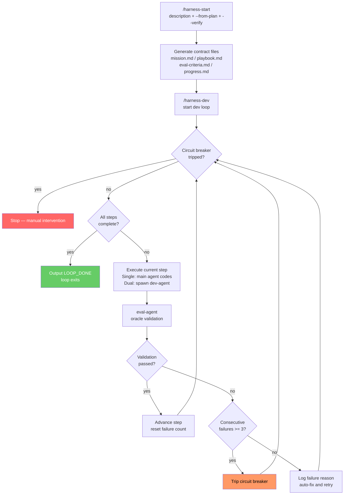

# OpenHarness for Claude Code

Autonomous AI agent execution framework adapted from [OpenHarness](https://github.com/thu-nmrc/OpenHarness) Harness Engineering principles for Claude Code.

English | [中文](README.md)

## What It Does

Turns Claude Code into a 24/7 autonomous development worker through **mechanical constraints, external audit, and 100% traceability**:

- **Machine-verifiable contracts** — objective "done" conditions, no subjective judgments
- **Oracle-isolated validation** — an independent agent validates your work; you cannot self-certify
- **Circuit breaker** — auto-stops after 3 consecutive failures
- **Three-layer memory** — state pointer (<2KB) + knowledge files + execution stream
- **Switchable execution modes** — single (plan+code) or dual (plan → spawn coder agent)
- **`/loop` integration** — recurring execution without external cron

## Quick Start

```bash
# Install plugin
claude --plugin-dir /path/to/openharness-cc

# Initialize a new task
/harness-start "Build a REST API for user management" --verify "Ensure all tests pass"

# Start autonomous development loop
/harness-dev

# Check current status
/harness-status
```

## Commands

| Command | Description |
|---|---|
| `/harness-start` | Initialize a new harness task with mission, playbook, eval criteria |
| `/harness-dev` | Start the autonomous development loop (single or dual mode) |
| `/harness-status` | Show current workspace status, progress, and circuit breaker state |
| `/harness-edit` | Modify an existing task (verify instruction, mission, playbook, etc.) |

## Usage

### Step 1: Initialize Task `/harness-start`

Tell Claude Code what you want done. The plugin auto-generates contract files.

```bash
# Describe the task directly
/harness-start "Add user registration and login" --verify "Ensure all tests pass"

# Initialize from a plan file (e.g., superpowers output)
/harness-start --from-plan docs/superpowers/specs/my-feature-design.md --mode dual
```

**Parameters:**

| Parameter | Required | Description | Example |
|---|---|---|---|
| `"task description"` | No* | One-sentence description of what you want, composable with `--from-plan` | `"Build REST API"` |
| `--from-plan PATH` | No* | Initialize from a plan/design file | `--from-plan plan.md` |
| `--mode single\|dual` | No | Execution mode, default `single` | `--mode dual` |
| `--verify "instruction"` | No | Natural language verification instruction for eval-agent | `--verify "Ensure all tests pass"` |

> *At least one of task description or `--from-plan` is required. When both are provided, the plan provides structure (steps, architecture) and the description adds supplementary context and constraints.

### Step 2: Start Development Loop `/harness-dev`

Agent starts working autonomously, looping until the task is complete.

```bash
/harness-dev
```

**Parameters:**

| Parameter | Required | Description | Example |
|---|---|---|---|
| `--mode single\|dual` | No | Execution mode, default `single` | `--mode dual` |
| `--worktree` | No | Enable git worktree isolation in dual mode (default: work in-place) | `--worktree` |
| `--max-iterations N` | No | Max loop iterations, 0 = infinite (default) | `--max-iterations 10` |

> Note: `--verify` is specified only in `/harness-start`. `/harness-dev` reads it from the state file.

### Modify Task `/harness-edit`

Modify an existing task's configuration at any time:

```bash
# Change verify instruction
/harness-edit --verify "Ensure all API endpoints return correct status codes"

# Update mission description
/harness-edit --mission "Add user avatar upload feature"

# Append a playbook step
/harness-edit --append-step "Add avatar upload API endpoint"

# Load modifications from file
/harness-edit --from-file docs/updated-plan.md

# Interactive mode (no arguments)
/harness-edit
```

## `--verify` Verification Instruction

`--verify` accepts a **natural language instruction** that the independent eval-agent interprets and validates. This is the core of OpenHarness external validation — the agent cannot self-certify completion.

**Examples:**

```bash
# Test verification
/harness-start "Implement login" --verify "Ensure all tests pass"

# Functional verification
/harness-start "Build REST API" --verify "All API endpoints return correct HTTP status codes"

# Comprehensive verification
/harness-start "Refactor auth module" --verify "All existing tests pass and new module has complete unit test coverage"
```

Without `--verify`, the eval-agent still performs structural validation based on `eval-criteria.md` (checking file existence, content plausibility), but lacks targeted semantic verification.

## Execution Modes

### Single Mode (default)

```
Main Agent (plan + code) → eval-agent (independent validation) → pass/fail
```

The agent plans and codes itself, but **validation is done by an independent eval-agent**. Best for bug fixes, single-file changes, small features.

### Dual Mode (default: in-place)

```
Main Agent (plan only) → dev-agent (codes in current dir) → eval-agent (validates) → pass/fail
```

Planning and coding are separated. The main agent writes a tech spec, spawns `harness-dev-agent` to implement in the current directory. The main benefit is **protecting the main agent's context** — coding details stay in the subagent.

```bash
/harness-dev --mode dual
```

### Dual Mode + Worktree Isolation

```
Main Agent (plan only) → dev-agent (codes in isolated worktree) → eval-agent (validates) → pass/fail
```

Adds `--worktree` flag to dual mode so dev-agent works in an isolated git branch, with changes merged back on success. Best for multi-module development, architecture refactors that need **strict git isolation**.

```bash
/harness-dev --mode dual --worktree
```

## Architecture

```
openharness-cc/
  skills/          5 behavioral skills (core, init, execute, eval, dream)
  commands/        4 slash commands (start, dev, status, edit)
  agents/          2 autonomous agents (dev-agent, eval-agent)
  hooks/           3 event hooks (SessionStart, PreToolUse, Stop)
  scripts/         4 utility scripts (state-manager, eval-check, setup-loop, cleanup)
  templates/       4 scaffold templates (mission, playbook, eval-criteria, progress)
```

## Workflow



### Core Flow (text)

```
/harness-start "task description" --verify "instruction"
  → Create mission.md (contract) + playbook.md (steps) + eval-criteria.md (validation)
  → Initialize .claude/harness-state.local.md (state file)

/harness-dev
  → Stop Hook drives each loop iteration
  → Each round: read state → execute playbook step → spawn eval-agent → update state
  → Consecutive failures >= 3 → circuit breaker trips, execution halts
  → All done → <promise>LOOP_DONE</promise> → loop exits
```

## OpenHarness Mapping

| OpenHarness (OpenClaw/Codex) | This Plugin |
|---|---|
| `cron` + `harness_setup_cron.py` | `/loop` built-in command |
| `harness_coordinator.py` | Claude Code agent spawning + worktrees |
| `harness_eval.py` | `harness-eval-agent` (oracle isolation) |
| `harness_boot.py` circuit breaker | Stop hook + state file |
| `harness_dream.py` | `harness-dream` skill + `/loop 24h` |
| `harness_linter.py` | PreToolUse hook |
| `heartbeat.md` | `.claude/harness-state.local.md` |

## License

Based on [OpenHarness](https://github.com/thu-nmrc/OpenHarness) by thu-nmrc (BSL 1.1).
This Claude Code adaptation is provided as-is.
