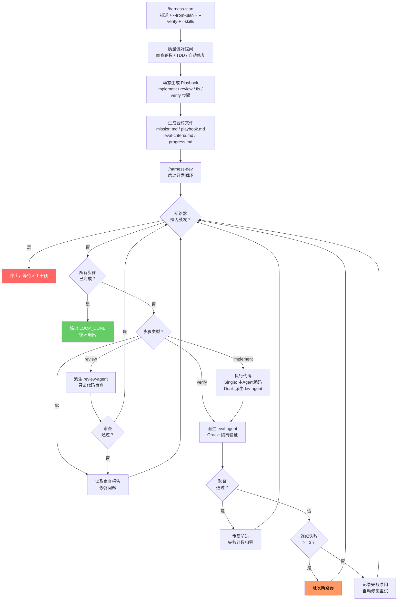

# OpenHarness for Claude Code

基于 [OpenHarness](https://github.com/thu-nmrc/OpenHarness) Harness Engineering 原则，为 Claude Code 适配的自主 AI Agent 执行框架。

[English](README.en.md) | 中文

## 它做什么

通过**机械约束、外部审计、100% 可追溯**，将 Claude Code 变成 24/7 自主开发工作者：

- **机器可验证合约** — 客观的"完成"判定条件，拒绝主观判断
- **Oracle 隔离验证** — 独立 agent 验证你的工作，你不能自我认证
- **断路器保护** — 连续 3 次失败后自动停止
- **三层记忆** — 状态指针 (<2KB) + 知识文件 + 执行流日志
- **动态工作流** — 根据任务需求自动生成开发/审查/修复循环
- **可切换执行模式** — single（规划+编码）或 dual（规划 → 派生编码 agent）
- **Skill 注入** — 指定 dev-agent 加载的技能，按需获取领域知识
- **`/loop` 集成** — 无需外部 cron，使用 Claude Code 内置循环

## 安装

```bash
# 方式一：启动时指定插件目录
claude --plugin-dir /path/to/openharness-cc

# 方式二：克隆到 Claude Code 插件目录
git clone https://github.com/Luck9Star/OpenHarness-For-ClaudeCode ~/.claude/plugins/openharness-cc
```

安装后，在任意项目目录启动 Claude Code 即可使用 `/harness-start`、`/harness-dev`、`/harness-status`、`/harness-edit` 命令。

## 使用流程

### 第一步：初始化任务 `/harness-start`

告诉 Claude Code 你要做什么。插件会自动生成合约文件。

```bash
# 直接描述任务
/harness-start "为当前项目添加用户注册和登录功能" --verify "确保所有测试通过"

# 从方案文件初始化（如 superpowers 产出的计划）
/harness-start --from-plan docs/superpowers/specs/my-feature-design.md --mode dual

# 指定 dev-agent 使用的技能
/harness-start "添加 React 组件" --skills "tdd,react-patterns" --verify "所有测试通过"
```

**这条命令会做什么：**

1. 在当前项目目录下创建 `.claude/harness-state.local.md`（状态文件）
2. 生成 `mission.md` — 任务合约，定义"做什么"和"什么算完成"
3. 生成 `playbook.md` — 执行步骤，Agent 按步骤执行
4. 生成 `eval-criteria.md` — 验证标准，每步完成后外部验证
5. 生成 `progress.md` — 进度日志，记录每次执行结果

**参数说明：**

| 参数 | 必填 | 说明 | 示例 |
|---|---|---|---|
| `"任务描述"` | 否* | 一句话描述你想让 Agent 完成什么，可与 `--from-plan` 叠加 | `"构建 REST API"` |
| `--from-plan PATH` | 否* | 从方案/计划文件初始化任务 | `--from-plan plan.md` |
| `--mode single\|dual` | 否 | 执行模式，默认 `single`（见下方说明） | `--mode dual` |
| `--verify "指令"` | 否 | 自然语言验证指令，eval-agent 用来判断任务是否完成 | `--verify "确保所有测试通过"` |
| `--skills "s1,s2"` | 否 | dev-agent 按需加载的技能名称，逗号分隔 | `--skills "tdd,react-patterns"` |

> *任务描述和 `--from-plan` 至少提供一个。两者都提供时，方案提供结构（步骤、架构），描述补充上下文和约束。

### 动态工作流生成

初始化时，AI 会根据任务复杂度询问质量偏好：

1. **需要代码审查吗？** — 审查几轮？（0 = 不审查，1 = 审查一次，2+ = 多轮审查-修复循环）
2. **需要 TDD 吗？** — 先写测试再实现
3. **验证失败后自动修复？** — 还是停下来等你确认

AI 根据回答**动态生成 playbook 步骤**，每个步骤带有类型标记：

| 步骤类型 | 说明 |
|---|---|
| `implement` | 编写/创建/修改代码 |
| `review` | 派生 review-agent 进行只读代码审查 |
| `fix` | 根据审查意见修复问题 |
| `verify` | 派生 eval-agent 进行独立验证 |

**示例：用户要求"严格审查，2 轮"**

```
Step 1 (implement) → Step 2 (review) → Step 3 (fix) → Step 4 (review) → Step 5 (fix) → Step 6 (verify)
```

**示例：用户要求"快速实现，不需要审查"**

```
Step 1 (implement) → Step 2 (implement) → Step 3 (verify)
```

简单任务（如改配置）AI 会自动跳过质量提问，生成最简步骤。

### 第二步：启动开发循环 `/harness-dev`

Agent 开始自主工作，循环执行直到任务完成。

```bash
/harness-dev
```

**参数说明：**

| 参数 | 必填 | 说明 | 示例 |
|---|---|---|---|
| `--mode single\|dual` | 否 | 执行模式，默认 `single` | `--mode dual` |
| `--worktree` | 否 | dual 模式下启用 git worktree 隔离（默认在当前目录工作） | `--worktree` |
| `--max-iterations N` | 否 | 最大循环次数，0 表示无限（默认） | `--max-iterations 10` |

> 注意：`--verify` 只在 `/harness-start` 中指定，`/harness-dev` 从状态文件读取，无需重复。

### 修改任务 `/harness-edit`

任务初始化后，可以随时修改任务配置：

```bash
# 修改验证指令
/harness-edit --verify "确保所有 API 返回正确状态码"

# 修改任务描述
/harness-edit --mission "新增用户头像上传功能"

# 追加执行步骤
/harness-edit --append-step "添加头像上传 API 端点"

# 从文件加载修改
/harness-edit --from-file docs/updated-plan.md

# 无参数进入交互模式
/harness-edit
```

### 查看状态 `/harness-status`

随时查看当前任务进度。

```bash
/harness-status
```

显示：任务名称、执行模式、当前步骤、失败次数、断路器状态、总执行次数。

## `--verify` 验证指令

`--verify` 是 OpenHarness 外部验证机制的核心抓手。它接受一段**自然语言指令**，由独立的 eval-agent 解释并执行。

**为什么需要它：** Agent 不能自我认证"我做完了"——这是 Harness Engineering 的基本原则。必须通过独立的 eval-agent 来验证。

**常用示例：**

```bash
# 测试验证
/harness-start "实现登录功能" --verify "确保所有测试通过"

# 功能验证
/harness-start "构建 REST API" --verify "所有 API 端点返回正确的 HTTP 状态码"

# 综合验证
/harness-start "重构认证模块" --verify "确保所有现有测试通过，新模块有完整的单元测试覆盖"

# 中文或英文均可
/harness-start "Add payment integration" --verify "All payment flows complete successfully with no test failures"
```

如果不指定 `--verify`，eval-agent 仍会根据 `eval-criteria.md` 做结构性验证（检查文件是否存在、内容是否合理等），但缺少针对性的语义验证。

## `--skills` 技能注入

`--skills` 让 dev-agent 在开发过程中按需加载指定技能，获取领域知识指导。

```bash
# TDD + React 开发
/harness-start "添加用户列表组件" --skills "tdd,react-patterns"

# 使用特定框架的最佳实践
/harness-start "构建 API 端点" --skills "express-best-practices,rest-api-design"
```

Dev-agent 收到技能名称后，通过 Skill 工具加载对应的 SKILL.md 内容，在实现过程中遵循技能指导。技能名称对应已安装插件中的 skill 名称。

## 执行模式

### Single 模式（默认）

```
主 Agent（规划 + 编码）→ eval-agent（独立验证）→ 通过/失败
```

Agent 自己规划步骤，自己写代码，但**验证环节由独立的 eval-agent 完成**。适合 bugfix、单文件修改、小功能开发。

### Dual 模式（默认在当前目录工作）

```
主 Agent（只规划）→ dev-agent（当前目录中编码）→ eval-agent（独立验证）→ 通过/失败
```

规划和编码分离。主 Agent 写 tech spec，派生 `harness-dev-agent` 在当前目录实现代码。主要好处是**保护主 Agent 上下文**——编码细节留在子 agent 中。

```bash
/harness-dev --mode dual
```

### Dual 模式 + Worktree 隔离

```
主 Agent（只规划）→ dev-agent（隔离 worktree 中编码）→ eval-agent（独立验证）→ 通过/失败
```

在 dual 模式基础上，加 `--worktree` 标志让 dev-agent 在独立 git worktree 分支中工作，代码变更在独立分支上完成后合并回主分支。适合多模块开发、架构重构等需要**严格 git 隔离**的场景。

```bash
/harness-dev --mode dual --worktree
```

## 工作流



**完整文字示例：**

```
你在 Claude Code 中输入:
  /harness-start "为 Express 应用添加 JWT 认证中间件" --verify "确保所有测试通过"

AI 质量偏好提问:
  "需要代码审查吗？几轮？" → "2轮"
  "需要 TDD 吗？" → "是"
  "验证失败自动修复？" → "是"

插件动态生成:
  mission.md      → 定义目标：实现 JWT 认证，所有测试通过
  playbook.md     → 步骤：
    Step 1 (verify)    → 编写测试用例
    Step 2 (implement) → 实现 auth.middleware.js
    Step 3 (review)    → review-agent 审查代码质量
    Step 4 (fix)       → 根据审查意见修复
    Step 5 (review)    → 第二轮审查
    Step 6 (fix)       → 根据第二轮意见修复
    Step 7 (verify)    → eval-agent 独立验证
  eval-criteria.md → 验证：测试通过、中间件文件存在、路由受保护
  harness-state.local.md → 状态：idle, Step 1

你启动循环:
  /harness-dev

第1轮: Step 1 (verify) → 编写测试用例 → eval 验证通过 → Step 1 完成
第2轮: Step 2 (implement) → 实现 auth.middleware.js → eval 验证通过
第3轮: Step 3 (review) → review-agent 审查 → 发现 2 个 major 问题
第4轮: Step 4 (fix) → 修复审查发现的问题 → eval 验证通过
第5轮: Step 5 (review) → review-agent 二次审查 → 通过
第6轮: Step 6 (fix) → 无需修复，跳过 → 继续
第7轮: Step 7 (verify) → eval-agent 最终验证 → 全部通过

最终:
  → 所有步骤完成 + eval-agent 确认验证通过
  → 输出 <promise>LOOP_DONE</promise>
  → 循环退出
```

## 安全机制

| 机制 | 说明 |
|---|---|
| 断路器 | 连续 3 次验证失败后自动停止，防止无限循环浪费 token |
| PreToolUse Hook | 自动阻止违反 `mission.md` 禁止操作的文件写入 |
| Oracle 隔离 | eval-agent 无法看到主 Agent 的推理过程，只看工作区产物 |
| 状态文件保护 | `mission.md` 和状态文件在初始化后变为只读，Agent 不可修改 |

## 架构

```
openharness-cc/
  skills/          5 个行为技能（core, init, execute, eval, dream）
  commands/        4 个斜杠命令（start, dev, status, edit）
  agents/          3 个自主 agent（dev-agent, eval-agent, review-agent）
  hooks/           3 个事件 hook（SessionStart, PreToolUse, Stop）
  scripts/         4 个工具脚本（state-manager, eval-check, setup-loop, cleanup）
  templates/       4 个脚手架模板（mission, playbook, eval-criteria, progress）
```

## OpenHarness 映射

| OpenHarness (OpenClaw/Codex) | 本插件 |
|---|---|
| `cron` + `harness_setup_cron.py` | `/loop` 内置命令 |
| `harness_coordinator.py` | Claude Code agent spawning + worktree |
| `harness_eval.py` | `harness-eval-agent`（Oracle 隔离） |
| `harness_boot.py` 断路器 | Stop hook + 状态文件 |
| `harness_dream.py` | `harness-dream` skill + `/loop 24h` |
| `harness_linter.py` | PreToolUse hook |
| `heartbeat.md` | `.claude/harness-state.local.md` |

## 许可证

基于 [OpenHarness](https://github.com/thu-nmrc/OpenHarness) by thu-nmrc (BSL 1.1)。
本 Claude Code 适配版本按原样提供。
