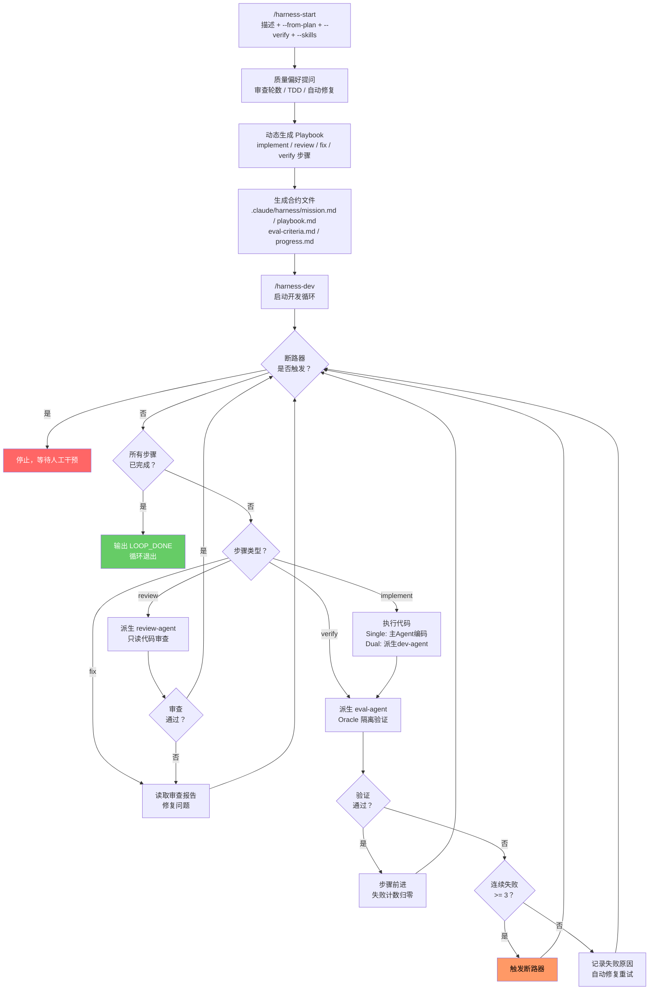

# OpenHarness for Claude Code

基于 [OpenHarness](https://github.com/thu-nmrc/OpenHarness) Harness Engineering 原则，为 Claude Code 适配的自主 AI Agent 执行框架。

[English](README.en.md) | 中文

## 它做什么

通过**机械约束、外部审计、100% 可追溯**，将 Claude Code 变成 24/7 自主开发工作者：

- **机器可验证合约** — 客观的"完成"判定条件，拒绝主观判断
- **Oracle 隔离验证** — 独立 agent 验证你的工作，你不能自我认证
- **断路器保护** — 连续 3 次失败后自动停止
- **三层记忆** — 状态指针 (<2KB) + 知识文件 + 执行流日志
- **动态工作流** — 根据任务需求自动生成开发/审查/修复循环
- **可切换执行模式** — single（规划+编码）或 dual（规划 → 派生编码 agent）
- **Skill 注入** — 指定 dev-agent 加载的技能，按需获取领域知识
- **`/loop` 集成** — stop-hook 驱动 step-by-step 循环，一个 iteration 执行一个 step

## 安装

```bash
# 方式一：启动时指定插件目录
claude --plugin-dir /path/to/openharness-cc

# 方式二：克隆到 Claude Code 插件目录
git clone https://github.com/Luck9Star/OpenHarness-For-ClaudeCode ~/.claude/plugins/openharness-cc
```

安装后，在任意项目目录启动 Claude Code 即可使用 `/harness-start`、`/harness-dev`、`/harness-status`、`/harness-edit` 命令。

## 使用流程

### 第一步：初始化任务 `/harness-start`

告诉 Claude Code 你要做什么。插件会自动生成合约文件。

```bash
# 直接描述任务
/harness-start "为当前项目添加用户注册和登录功能" --verify "确保所有测试通过"

# 从方案文件初始化（如 superpowers 产出的计划）
/harness-start --from-plan docs/superpowers/specs/my-feature-design.md --mode dual

# 指定 dev-agent 使用的技能
/harness-start "添加 React 组件" --skills "tdd,react-patterns" --verify "所有测试通过"
```

**这条命令会做什么：**

1. 在当前项目目录下创建 `.claude/harness-state.json`（状态文件）
2. 生成 `.claude/harness/mission.md` — 任务合约，定义"做什么"和"什么算完成"
3. 生成 `.claude/harness/playbook.md` — 执行步骤，Agent 按步骤执行
4. 生成 `.claude/harness/eval-criteria.md` — 验证标准，每步完成后外部验证
5. 生成 `.claude/harness/progress.md` — 进度日志，记录每次执行结果

**参数说明：**

| 参数 | 必填 | 说明 | 示例 |
|---|---|---|---|
| `"任务描述"` | 否* | 一句话描述你想让 Agent 完成什么，可与 `--from-plan` 叠加 | `"构建 REST API"` |
| `--from-plan PATH` | 否* | 从方案/计划文件初始化任务 | `--from-plan plan.md` |
| `--mode single\|dual` | 否 | 执行模式，默认 `single`（见下方说明） | `--mode dual` |
| `--verify "指令"` | 否 | 自然语言验证指令，eval-agent 用来判断任务是否完成 | `--verify "确保所有测试通过"` |
| `--skills "s1,s2"` | 否 | dev-agent 按需加载的技能名称，逗号分隔 | `--skills "tdd,react-patterns"` |
| `--quick` | 否 | 跳过向导，直接使用提供的参数 | `--quick` |

> *任务描述和 `--from-plan` 至少提供一个。两者都提供时，方案提供结构（步骤、架构），描述补充上下文和约束。

### 交互式向导

当缺少关键参数时（没有 `--verify`、没有描述等），`/harness-start` 进入**向导模式** — 通过多轮交互帮助你精确定义任务：

| 向导步骤 | 做什么 | 产出 |
|---|---|---|
| **1A: 任务扩展** | 分析代码库（技术栈、项目结构、测试模式），扩展任务描述，补充具体范围和受影响文件 | 精化的任务描述 |
| **1B: 交付物列举** | 根据扩展后的任务，列举具体的文件级交付物 | 可验证的输出清单 |
| **1C: 推导 Verify** | 从交付物生成 `--verify` — 每条检查都是量化的、机器可验证的，一个交付物对应一条检查 | 精确的 verify 指令 |
| **1D: 技能推荐** | 根据检测到的技术栈和任务类型推荐技能 | 验证过的技能列表 |

每一步都会展示结果供你确认后再继续。这确保了 verify 覆盖范围与实际交付物一一对应 — 在初始化阶段就解决 verify 覆盖不全的问题。

**快速模式**完全跳过向导，激活条件：
1. 提供了任务描述（或 `--from-plan`）
2. 提供了 `--verify`
3. 设置了 `--quick` 标志，或同时指定了 `--mode` 和 `--skills`

```bash
# 向导模式 — 缺少 verify 触发交互流程
/harness-start "为当前项目添加用户注册和登录功能"

# 快速模式 — 参数齐全，无向导
/harness-start "为当前项目添加用户注册和登录功能" \
  --verify "所有测试通过，注册 API 返回 201" \
  --skills "tdd" --mode single
```

**任务覆盖机制：** 每个项目目录同一时间只能有一个活跃 harness 任务。再次执行 `/harness-start` 时：

- 如果已有活跃任务（status 为 `running` 或 `idle`），会提示确认，需要用户同意才会覆盖
- 已完成（`mission_complete`）或已失败（`failed`）的任务可直接覆盖，无需确认
- 覆盖前，旧任务的 workspace 文件会自动归档到 `.claude/harness/archive/{任务名}-{时间戳}/`
- 归档保留最近 5 份，更早的由 `cleanup.py` 自动清理

### 动态工作流生成

初始化时，AI 会根据任务复杂度询问质量偏好：

1. **需要代码审查吗？** — 审查几轮？（0 = 不审查，1 = 审查一次，2+ = 多轮审查-修复循环）
2. **需要 TDD 吗？** — 先写测试再实现
3. **验证失败后自动修复？** — 还是停下来等你确认

AI 根据回答**动态生成 playbook 步骤**，每个步骤带有类型标记：

| 步骤类型 | 说明 |
|---|---|
| `implement` | 编写/创建/修改代码 |
| `review` | 派生 review-agent 进行只读代码审查 |
| `fix` | 根据审查意见修复问题 |
| `verify` | 派生 eval-agent 进行独立验证 |
| `human-review` | 暂停循环等待人工确认（可选，默认不插入） |

**示例：用户要求"严格审查，2 轮"**

```
Step 1 (implement) → Step 2 (review) → Step 3 (fix) → Step 4 (review) → Step 5 (fix) → Step 6 (verify)
```

**示例：用户要求"快速实现，不需要审查"**

```
Step 1 (implement) → Step 2 (implement) → Step 3 (verify)
```

简单任务（如改配置）AI 会自动跳过质量提问，生成最简步骤。

### 第二步：启动开发循环 `/harness-dev`

Agent 开始自主工作，通过 stop-hook 驱动循环执行。**推荐使用 `/loop` 确保持续循环：**

```bash
/loop /harness-dev
```

> **循环机制**：每次 iteration，agent 执行一个 playbook step → spawn eval-agent 验证 → 更新状态 → turn 结束 → stop-hook 拦截退出 → 推送 continuation prompt → 执行下一个 step。直到所有 step 完成且 eval-agent 确认通过，agent 输出 `<promise>LOOP_DONE</promise>`，循环退出。

也可以直接运行（不使用 `/loop`，依赖 stop-hook 驱动循环）：

```bash
/harness-dev
```

**参数说明：**

| 参数 | 必填 | 说明 | 示例 |
|---|---|---|---|
| `--mode single\|dual` | 否 | 执行模式，默认 `single` | `--mode dual` |
| `--max-iterations N` | 否 | 最大循环次数，0 表示无限（默认） | `--max-iterations 10` |
| `--resume` | 否 | 从 human-review 暂停点恢复执行 | `--resume` |

> 注意：`--verify` 只在 `/harness-start` 中指定，`/harness-dev` 从状态文件读取，无需重复。

### 修改任务 `/harness-edit`

任务初始化后，可以随时修改任务配置：

```bash
# 修改验证指令
/harness-edit --verify "确保所有 API 返回正确状态码"

# 修改任务描述
/harness-edit --mission "新增用户头像上传功能"

# 追加执行步骤
/harness-edit --append-step "添加头像上传 API 端点"

# 从文件加载修改
/harness-edit --from-file docs/updated-plan.md

# 无参数进入交互模式
/harness-edit
```

### 查看状态 `/harness-status`

随时查看当前任务进度。

```bash
/harness-status
```

显示：任务名称、执行模式、当前步骤、失败次数、断路器状态、总执行次数。

## `--verify` 验证指令

`--verify` 是 OpenHarness 外部验证机制的核心抓手。它接受一段**自然语言指令**，由独立的 eval-agent 解释并执行。

**为什么需要它：** Agent 不能自我认证"我做完了"——这是 Harness Engineering 的基本原则。必须通过独立的 eval-agent 来验证。

**常用示例：**

```bash
# 测试验证
/harness-start "实现登录功能" --verify "确保所有测试通过"

# 功能验证
/harness-start "构建 REST API" --verify "所有 API 端点返回正确的 HTTP 状态码"

# 综合验证
/harness-start "重构认证模块" --verify "确保所有现有测试通过，新模块有完整的单元测试覆盖"

# 中文或英文均可
/harness-start "Add payment integration" --verify "All payment flows complete successfully with no test failures"
```

如果不指定 `--verify`，eval-agent 仍会根据 `.claude/harness/eval-criteria.md` 做结构性验证（检查文件是否存在、内容是否合理等），但缺少针对性的语义验证。

## 任务编写指南

`--verify` 的覆盖范围决定了 eval-agent 的验证深度。**verify 只检查你明确列出的维度**——不会自动覆盖任务描述中的隐含期望。

### 反模式：verify 覆盖不全

```bash
# 任务有 4 个维度（评审、对齐、测试、性能），但 verify 只覆盖了测试
/harness-start "评审 Rust 实现，检查 CLI 对齐，补齐 E2E 测试，优化性能" \
  --verify "单元测试成功，E2E 测试通过"
# 结果：eval-agent 只跑测试，"评审"变成 clippy 清理，一轮就过
```

### 推荐写法

**方案 A：拆任务，每个任务目标单一（推荐）**

```bash
# 任务 1：纯评审（交付物是报告文件）
/harness-start "对 Rust 实现（6 crate）进行深度代码评审。
交付物：评审报告，覆盖架构设计、跨 crate 依赖、错误处理策略、
public API 惯用法、并发安全性。每个问题标注 critical/major/minor。" \
  --verify "评审报告文件存在，每个 crate 有 >=3 条具体发现，
所有 critical 发现都有修复建议"
```

等任务 1 完成后（`/harness-dev` 循环退出），再执行：

```bash
# 任务 2：CLI 对齐
/harness-start "检查 Rust CLI 与 Python CLI 的对齐，修复所有差异" \
  --verify "对齐报告存在且所有 E2E CLI 测试通过"
```

等任务 2 完成后，再执行：

```bash
# 任务 3：性能优化
/harness-start "检查并优化 Rust 性能瓶颈" \
  --verify "benchmark 全部在阈值内，无性能回归"
```

> **重要：** 拆分的任务必须**依次独立执行**——每个任务走完完整的 `/harness-start` → `/harness-dev` → `LOOP_DONE` 流程后，再开始下一个。不能在同一会话中连续执行多次 `/harness-start` 期望它们排队执行，因为后一个会覆盖前一个。

**方案 B：单任务但 verify 覆盖全维度**

```bash
/harness-start "完成以下 4 项工作：
1. 深度评审 Rust 6 crate（每 crate >=3 条发现，标注严重等级）；
2. 产出 CLI 对齐报告，修复差异；
3. 补齐 E2E 测试，覆盖所有子命令；
4. benchmark 全部在阈值内。" \
  --mode dual \
  --verify "
  1. 评审报告存在且每 crate 有 >=3 条具体发现（非 clippy 级别）；
  2. CLI 对齐报告存在且所有差异已修复；
  3. cargo test 全部通过（含 E2E）；
  4. benchmark 全部在阈值内"
```

### 编写原则

| 原则 | 说明 |
|---|---|
| **交付物是文件，不是行为** | eval-agent 可以读文件验证报告内容，但无法验证"评审是否深入" |
| **verify 覆盖所有维度** | 任务有 N 个目标，verify 就要有 N 条检查 |
| **量化验收标准** | "每 crate >=3 条发现"比"充分评审"可验证 |
| **拆任务优于大任务** | 单一目标的任务更容易写出精确的 verify |

## `--skills` 技能注入

`--skills` 让 dev-agent 在开发过程中按需加载指定技能，获取领域知识指导。

```bash
# TDD + React 开发
/harness-start "添加用户列表组件" --skills "tdd,react-patterns"

# 使用特定框架的最佳实践
/harness-start "构建 API 端点" --skills "express-best-practices,rest-api-design"
```

Dev-agent 收到技能名称后，通过 Skill 工具加载对应的 SKILL.md 内容，在实现过程中遵循技能指导。技能名称对应已安装插件中的 skill 名称。

## 执行模式

### Single 模式（默认）

```
主 Agent（规划 + 编码）→ eval-agent（独立验证）→ 通过/失败
```

Agent 自己规划步骤，自己写代码，但**验证环节由独立的 eval-agent 完成**。适合 bugfix、单文件修改、小功能开发。

### Dual 模式（默认在当前目录工作）

```
主 Agent（只规划）→ dev-agent（当前目录中编码）→ eval-agent（独立验证）→ 通过/失败
```

规划和编码分离。主 Agent 写 tech spec，派生 `harness-dev-agent` 在当前目录实现代码。主要好处是**保护主 Agent 上下文**——编码细节留在子 agent 中。

```bash
/harness-dev --mode dual
```

### Dual 模式（上下文隔离）

```
主 Agent（只规划）→ dev-agent（当前目录编码）→ eval-agent（独立验证）→ 通过/失败
```

规划和编码分离，主 Agent 写 tech spec，派生 `harness-dev-agent` 在当前目录实现代码。主要好处是**保护主 Agent 上下文**——编码细节留在子 agent 中。适合多文件重构、架构调整等需要**保护主 Agent 上下文**的场景。

## 工作流



**完整文字示例：**

```
你在 Claude Code 中输入:
  /harness-start "为 Express 应用添加 JWT 认证中间件" --verify "确保所有测试通过"

AI 质量偏好提问:
  "需要代码审查吗？几轮？" → "2轮"
  "需要 TDD 吗？" → "是"
  "验证失败自动修复？" → "是"

插件动态生成:
  .claude/harness/mission.md → 定义目标：实现 JWT 认证，所有测试通过
  .claude/harness/playbook.md → 步骤：
    Step 1 (verify)    → 编写测试用例
    Step 2 (implement) → 实现 auth.middleware.js
    Step 3 (review)    → review-agent 审查代码质量
    Step 4 (fix)       → 根据审查意见修复
    Step 5 (review)    → 第二轮审查
    Step 6 (fix)       → 根据第二轮意见修复
    Step 7 (verify)    → eval-agent 独立验证
  .claude/harness/eval-criteria.md → 验证：测试通过、中间件文件存在、路由受保护
  .claude/harness-state.json → 状态：idle, Step 1

你启动循环:
  /harness-dev

第1轮: Step 1 (verify) → 编写测试用例 → eval 验证通过 → Step 1 完成
第2轮: Step 2 (implement) → 实现 auth.middleware.js → eval 验证通过
第3轮: Step 3 (review) → review-agent 审查 → 发现 2 个 major 问题
第4轮: Step 4 (fix) → 修复审查发现的问题 → eval 验证通过
第5轮: Step 5 (review) → review-agent 二次审查 → 通过
第6轮: Step 6 (fix) → 无需修复，跳过 → 继续
第7轮: Step 7 (verify) → eval-agent 最终验证 → 全部通过

最终:
  → 所有步骤完成 + eval-agent 确认验证通过
  → 输出 <promise>LOOP_DONE</promise>
  → 循环退出
```

## 安全机制

| 机制 | 说明 |
|---|---|
| 断路器 | 连续 3 次验证失败后自动停止，防止无限循环浪费 token |
| PreToolUse Hook | 保护 `.claude/harness-state.json` 不被 Agent 直接修改 |
| Oracle 隔离 | eval-agent 无法看到主 Agent 的推理过程，只看工作区产物 |
| 任务修改接口 | `.claude/harness/` 下的合约文件只能通过 `/harness-edit` 修改 |

## 架构

```
openharness-cc/
  skills/          7 个行为技能（core, start, dev, edit, status, eval, dream）
  agents/          3 个自主 agent（dev-agent, eval-agent, review-agent）
  hooks/           3 个事件 hook（SessionStart, PreToolUse, Stop）
  scripts/         4 个工具脚本（state-manager, stop-hook, setup-loop, cleanup）
  templates/       4 个脚手架模板（mission, playbook, eval-criteria, progress）
```

## OpenHarness 映射

| OpenHarness (OpenClaw/Codex) | 本插件 |
|---|---|
| `cron` + `harness_setup_cron.py` | `/loop` 内置命令 |
| `harness_coordinator.py` | Claude Code agent spawning |
| `harness_eval.py` | `harness-eval-agent`（Oracle 隔离） |
| `harness_boot.py` 断路器 | Stop hook + 状态文件 |
| `harness_dream.py` | `harness-dream` skill + `/loop 24h` |
| `harness_linter.py` | PreToolUse hook |
| `heartbeat.md` | `.claude/harness-state.json` |

## 许可证

基于 [OpenHarness](https://github.com/thu-nmrc/OpenHarness) by thu-nmrc (BSL 1.1)。
本 Claude Code 适配版本按原样提供。
